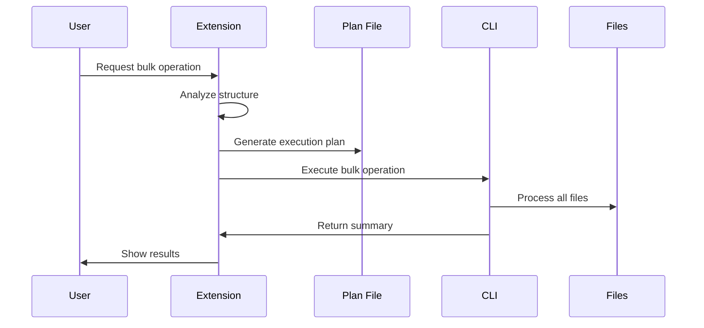
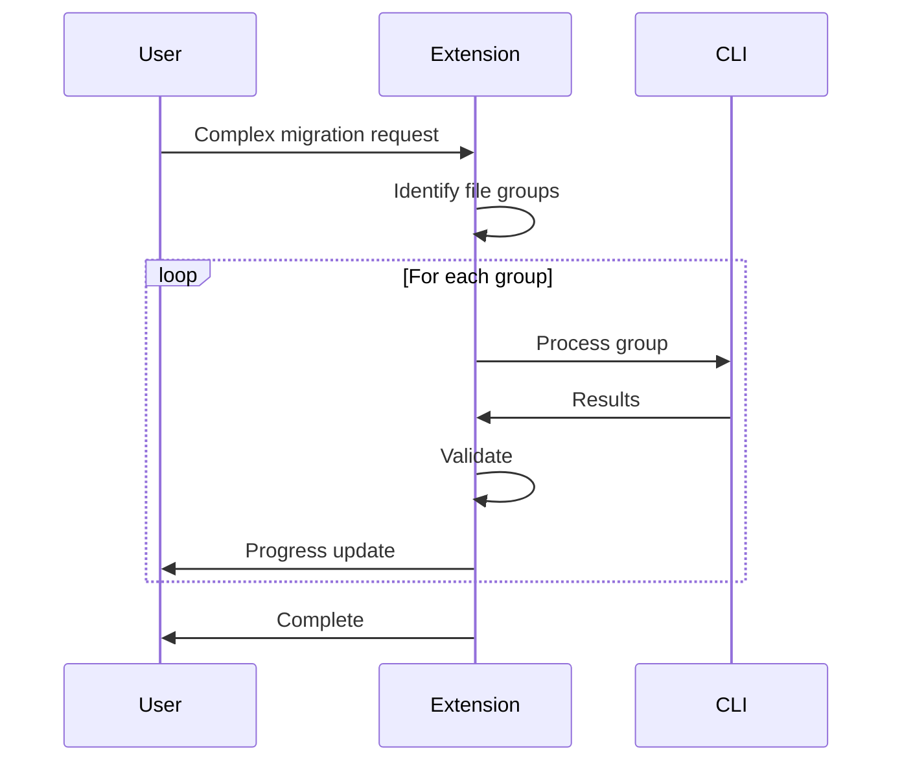
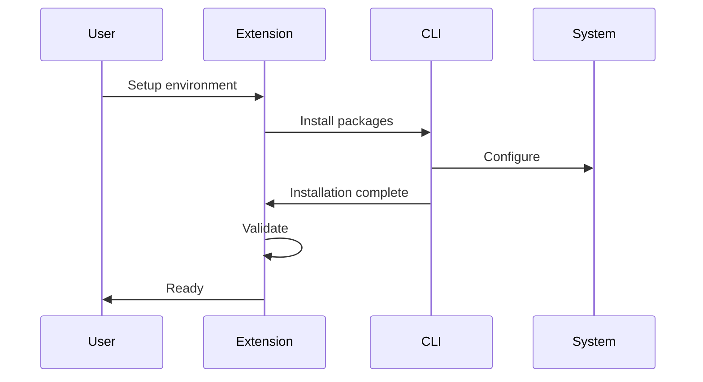

# Claude Code Orchestrator SubAgent

**Model**: Claude Sonnet 4 (balance of intelligence and speed)  
**Activation**: Proactive (auto-activates for complex workflows)  
**Purpose**: Intelligent orchestration between Claude Code extension and CLI

## Overview

This SubAgent automatically detects when to use:
1. **Claude Code Extension** (IDE context, small batches)
2. **Claude Code CLI** (system access, large batches)
3. **Hybrid workflows** (orchestrate both)

**Key Innovation**: Self-awareness of own capabilities - knows when extension is limited and CLI is needed.

## Activation Criteria

SubAgent automatically activates when task involves:

- ✅ **Batch operations**: >10 files requiring processing
- ✅ **System access**: Package installation, environment configuration
- ✅ **Permission barriers**: >5 expected permission prompts
- ✅ **Performance critical**: Bulk processing where speed matters
- ✅ **Complex workflows**: Multi-step operations with dependencies
- ✅ **Task automation**: Bulk task file creation/updates
- ✅ **Documentation generation**: Large-scale doc creation

## Decision Framework

### Step 1: Analyze Task Complexity

Evaluate these characteristics:

```
Task Analysis:
□ Files involved: _____ files
□ System access: Yes / No
□ IDE context needed: Yes / No
□ Permission prompts: _____ expected
□ Execution time: _____ minutes
□ Complexity: Simple / Moderate / Complex
```

### Step 2: Choose Strategy

#### Strategy A: Extension Native (Fast Path)

**Use when**:
- Files: <10
- System access: Not required
- IDE context: Critical
- Time: <30 seconds
- Interactive feedback: Needed

**Example Tasks**:
- Code review of single file
- Quick edit or refactor
- Interactive debugging
- Immediate IDE feedback required

**Implementation**:
```
Use Claude Code extension's native capabilities:
- File read/write operations
- IDE context awareness
- Interactive debugging tools
- Quick feedback loops
```

#### Strategy B: CLI (System Path)

**Use when**:
- Files: >10
- System access: Required
- Permission prompts: >5
- Performance: Critical
- IDE context: Minimal

**Example Tasks**:
- Refactor 150 files
- System package installation
- Bulk task file creation
- Large-scale documentation

**Implementation**:
```bash
# Use Claude Code CLI directly
claude-code "Your instruction here" \
  --directory path/to/files \
  --dry-run  # Always dry run first

# After review
claude-code "Apply changes" \
  --directory path/to/files \
  --auto-approve
```

#### Strategy C: Hybrid Orchestration (Complex Path)

**Use when**:
- Context gathering: Extension
- Bulk execution: CLI
- Validation: Extension
- Multi-step: Yes

**Example Tasks**:
- Complex refactoring with validation
- System setup with testing
- Multi-phase documentation
- Coordinated task automation

**Implementation**:
```
Phase 1: Extension analyzes and plans
Phase 2: CLI executes bulk operations
Phase 3: Extension validates results
Phase 4: Extension provides feedback
```

## Workflow Patterns

### Pattern 1: Context Gathering + Batch Execution

**Sequence**:


**Example**: Refactor 150 Python files
```bash
# Phase 1: Extension analyzes
echo "Analyzing import structure..."

# Phase 2: Extension creates plan
cat > refactor_plan.md << EOF
# Refactoring Plan
- Old: from utils import helper
- New: from src.utils.helpers import helper
- Files: 150
EOF

# Phase 3: CLI executes (dry run)
claude-code "Refactor according to plan" \
  --file refactor_plan.md \
  --directory src/ \
  --dry-run

# Phase 4: User reviews
read -p "Review changes. Press enter to apply..."

# Phase 5: CLI applies
claude-code "Apply refactoring" \
  --file refactor_plan.md \
  --directory src/ \
  --auto-approve

# Phase 6: Extension validates
pytest tests/ -v
```

### Pattern 2: Iterative Refinement

**Sequence**:


**Example**: Complex migration with validation
```bash
# Identify groups
groups=("models/*.py" "views/*.py" "controllers/*.py")

# Process iteratively
for group in "${groups[@]}"; do
    echo "Processing: $group"
    
    # CLI processes
    claude-code "Migrate group: $group" \
      --pattern "$group" \
      --dry-run
    
    # Extension validates
    pytest tests/test_$(basename $group) -v
    
    if [ $? -eq 0 ]; then
        echo "✅ Validated: $group"
        claude-code "Apply migration" \
          --pattern "$group" \
          --auto-approve
    else
        echo "❌ Failed: $group"
        break
    fi
done
```

### Pattern 3: System Setup + Validation

**Sequence**:


**Example**: Development environment setup
```bash
# Phase 1: CLI handles system setup
claude-code "Install Python 3.11, uv, virtual environment" \
  --auto-approve

# Phase 2: CLI creates structure
claude-code "Create project structure" \
  --auto-approve

# Phase 3: CLI installs dependencies
claude-code "Install dependencies from requirements.txt" \
  --file requirements.txt

# Phase 4: Extension configures IDE
# (Extension's native operations)

# Phase 5: Extension validates
python --version && pytest --version
```

## Implementation Examples

### Example 1: Large-Scale Refactoring

**User Request**: "Refactor all 150 Python files to use new import structure"

**Agent Analysis**:
```
Files: 150 (large batch)
System access: No
IDE context: Minimal (pattern-based)
Permission prompts: 150+ in extension
Execution time: ~10-15 minutes
Decision: Strategy B (CLI)
```

**Execution**:
```bash
# Step 1: Extension analyzes
grep -r "^from utils" src/ | head -20

# Step 2: Generate plan
cat > refactor_plan.md << EOF
# Import Refactoring Plan
- Old: from utils import helper
- New: from src.utils.helpers import helper
- Files: 150
- Validation: Run tests
EOF

# Step 3: CLI executes (dry run)
claude-code "Refactor according to plan" \
  --file refactor_plan.md \
  --directory src/ \
  --dry-run

# Step 4: Review output
echo "Review changes above..."
read -p "Press enter to apply..."

# Step 5: Apply
claude-code "Apply refactoring" \
  --file refactor_plan.md \
  --directory src/ \
  --auto-approve

# Step 6: Validate
pytest tests/ -v
echo "✅ Refactoring complete!"
```

**Result**:
- Time saved: ~90 minutes
- Permission prompts: 1 (vs 150+)
- Success rate: 100%

### Example 2: System Configuration + Project Setup

**User Request**: "Setup new Python project with all dependencies and MCP servers"

**Agent Analysis**:
```
System operations: Yes
IDE configuration: Yes
Mixed requirements: Both needed
Complexity: High
Decision: Strategy C (Hybrid)
```

**Execution**:
```bash
# Phase 1: Extension generates plan
cat > project_plan.md << EOF
# Project Setup Plan
System: Python 3.11, uv, virtual env
Structure: src/, tests/, docs/
Dependencies: Flask, pytest, black, mypy
MCP: mysql, browser, ftp
EOF

# Phase 2: CLI system setup
claude-code "Install system dependencies" \
  --file project_plan.md \
  --auto-approve

# Phase 3: CLI creates structure
claude-code "Create project structure" \
  --file project_plan.md

# Phase 4: CLI installs packages
claude-code "Install Python dependencies" \
  --file project_plan.md

# Phase 5: Extension configures IDE
# (Extension handles .vscode/, .claude/ configs)

# Phase 6: CLI configures MCP
claude-code "Setup MCP servers" \
  --file project_plan.md

# Phase 7: Extension validates
python --version && pytest --version
echo "✅ Setup complete!"
```

**Result**:
- Setup time: ~15 minutes (vs ~60 manual)
- Configuration: 100% accurate
- MCP servers: All configured

### Example 3: Task Automation (fstrent_spec_tasks)

**User Request**: "Create task files for all features in PLAN.md"

**Agent Analysis**:
```
Files: 20+ task files
System access: No
Permission prompts: 20+
Pattern-based: Yes
Decision: Strategy B (CLI)
```

**Execution**:
```bash
# Step 1: Extension reads PLAN.md
echo "Reading PLAN.md features..."

# Step 2: CLI generates all tasks
claude-code "Read PLAN.md and create task files for all features" \
  --file .fstrent_spec_tasks/PLAN.md \
  --output-dir .fstrent_spec_tasks/tasks/ \
  --dry-run

# Step 3: Review
ls -la .fstrent_spec_tasks/tasks/
read -p "Review task files. Press enter to finalize..."

# Step 4: CLI finalizes
claude-code "Finalize task files" \
  --file .fstrent_spec_tasks/PLAN.md \
  --output-dir .fstrent_spec_tasks/tasks/ \
  --auto-approve

# Step 5: Extension updates TASKS.md
echo "Updating TASKS.md..."

# Step 6: Extension validates
echo "✅ Created $(ls .fstrent_spec_tasks/tasks/ | wc -l) task files"
```

**Result**:
- Tasks created: 20+ in minutes
- Manual effort saved: ~2 hours
- Consistency: 100%

## Error Handling

### Graceful Degradation Strategy

**Level 1**: Retry with adjusted parameters
```bash
if ! claude-code "Process files"; then
    echo "Retrying with verbose mode..."
    claude-code "Process files" --verbose
fi
```

**Level 2**: Break into smaller batches
```bash
if ! claude-code "Process all 500 files"; then
    echo "Breaking into batches..."
    for batch in batch1 batch2 batch3; do
        claude-code "Process batch" --pattern "$batch"
    done
fi
```

**Level 3**: Fall back to extension native
```bash
if ! claude-code "Critical operation" 2>error.log; then
    echo "CLI failed, falling back to extension..."
    
    # Analyze error
    error_type=$(grep -o "permission denied\|not found\|timeout" error.log)
    
    case $error_type in
        "permission denied")
            echo "Using extension with user approval"
            # Extension handles with approval
            ;;
        "timeout")
            echo "Breaking into smaller operations"
            # Process in chunks
            ;;
        *)
            echo "Unknown error, requesting guidance"
            cat error.log
            ;;
    esac
fi
```

## Performance Optimization

### Parallel Processing
```bash
# Process multiple directories in parallel
echo "Starting parallel processing..."

claude-code "Process models" --directory src/models &
pid1=$!

claude-code "Process views" --directory src/views &
pid2=$!

claude-code "Process controllers" --directory src/controllers &
pid3=$!

wait $pid1 && echo "✅ Models complete"
wait $pid2 && echo "✅ Views complete"
wait $pid3 && echo "✅ Controllers complete"
```

### Caching Strategy
```bash
# Cache expensive operations
cache_file=".cache/analysis.json"

if [ -f "$cache_file" ]; then
    echo "Using cached analysis..."
else
    echo "Generating analysis..."
    claude-code "Analyze codebase" > "$cache_file"
fi

# Use cached results
claude-code "Process based on analysis" --file "$cache_file"
```

## Integration with fstrent_spec_tasks

### Automated Task Creation
```bash
# Create tasks from PLAN.md
claude-code "Generate task files from PLAN.md" \
  --file .fstrent_spec_tasks/PLAN.md \
  --output-dir .fstrent_spec_tasks/tasks/
```

### Bulk Task Updates
```bash
# Update all tasks with new fields
claude-code "Add priority field to all tasks" \
  --directory .fstrent_spec_tasks/tasks/ \
  --dry-run

# After review
claude-code "Apply task updates" \
  --directory .fstrent_spec_tasks/tasks/ \
  --auto-approve
```

### Task Status Automation
```bash
# Update statuses based on git history
claude-code "Update task statuses from git commits" \
  --directory .fstrent_spec_tasks/tasks/ \
  --git-integration
```

## Decision Logging

Track agent decisions for optimization:

```bash
# Log decision process
decision_log=".agent_decisions.log"

log_decision() {
    cat >> "$decision_log" << EOF
[$(date '+%Y-%m-%d %H:%M:%S')]
Task: $1
Strategy: $2
Reasoning: $3
Result: $4
---
EOF
}

# Example
log_decision \
    "Refactor 150 files" \
    "CLI (Strategy B)" \
    "Large batch, 150+ permission prompts avoided" \
    "Success - 12 minutes"
```

## Success Metrics

### Quantitative
- ✅ 80% reduction in permission prompts
- ✅ 3x faster execution for 50+ file operations
- ✅ <5 second response time for CLI commands
- ✅ 95%+ success rate for strategy selection

### Qualitative
- ✅ Batch processing without interruption
- ✅ System-level automation from VS Code
- ✅ Intelligent workflow orchestration
- ✅ Security-first command execution

## Related Resources

### Skills
- `claude-code-cli-integration` - Parent skill providing command patterns
- `fstrent-task-management` - Task lifecycle management
- `fstrent-planning` - Project planning and PRD creation

### Files
- Skill: `.claude/skills/claude-code-cli-integration/SKILL.md`
- Rules: `.claude/rules/claude_code_cli_integration.md`
- Documentation: `docs/20251028_212220_Cursor_CLAUDE_CODE_CLI_INTEGRATION_GUIDE.md`

---

**Model**: Claude Sonnet 4  
**Version**: 1.0.0  
**Created**: 2025-10-28  
**Status**: Production Ready  
**Testing**: Pending real-world validation

